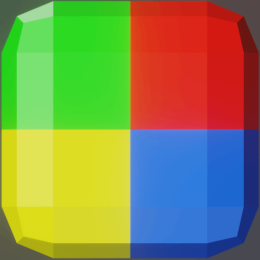
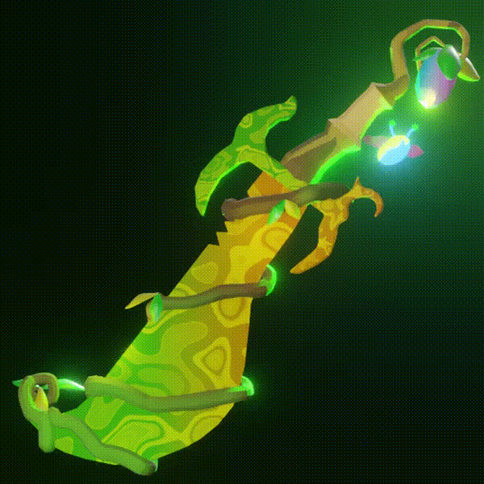
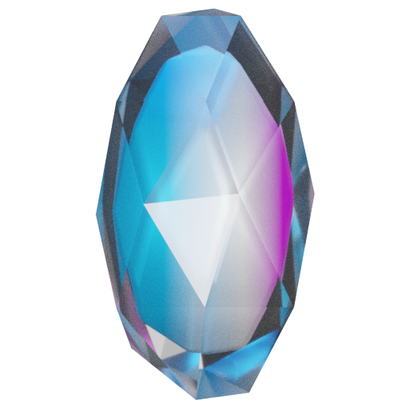
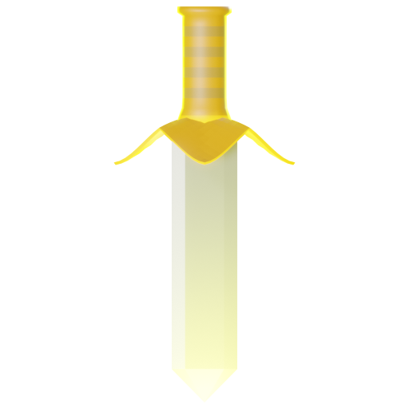
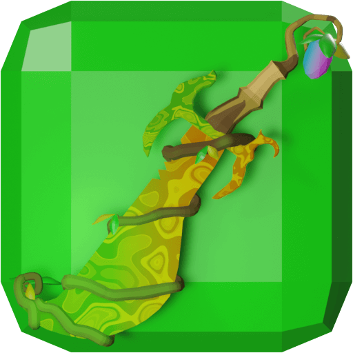
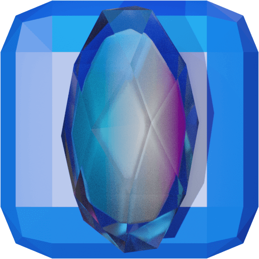
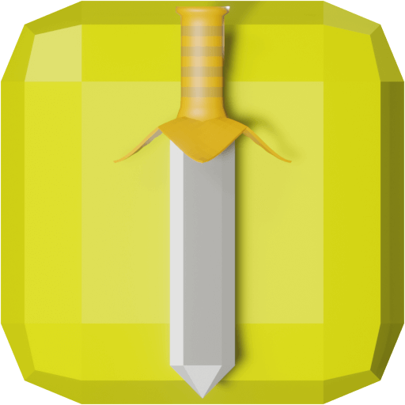
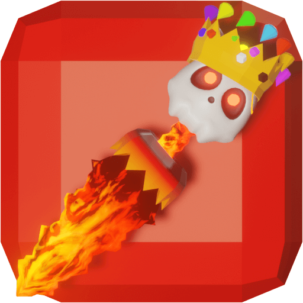
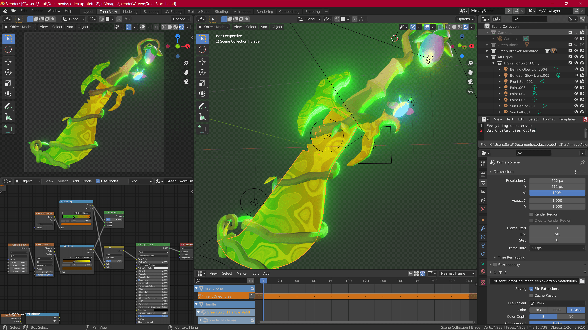
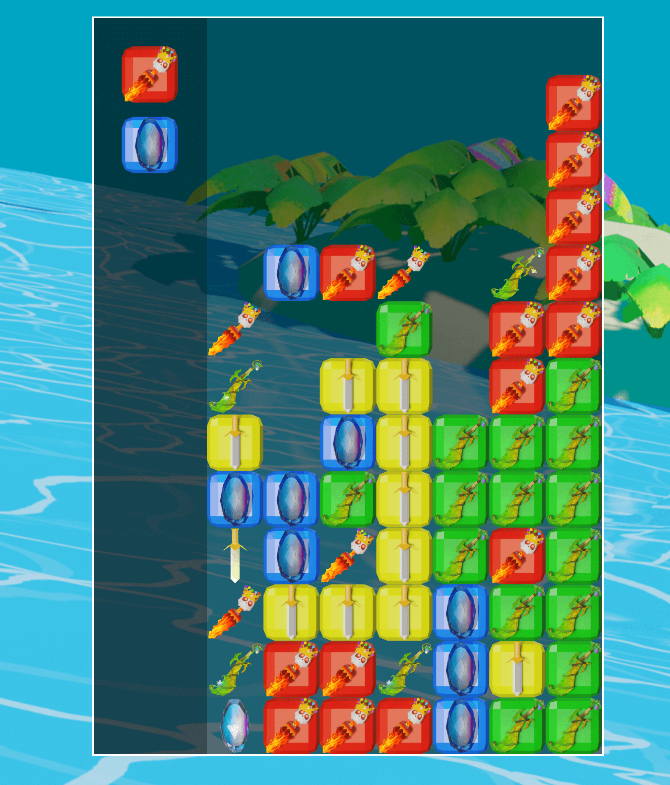

#  Captotetris 

Play it live here: [https://breaks.pirated.technology/](https://breaks.pirated.technology/)

The multiplayer is almost finished and can be found on [this branch](https://github.com/Captainlonate/captotetris2/tree/feature/multiplayer).

## Summary

This is a blocks-and-breakers style game, built with javascript. I wrote all the code and did all the art. I "found" the sound files online.

## How the game is played
You begrudgingly fill the board with blocks and pray that you get "breakers" (the swords without blocks). When a sword lands adjacent to a block, all of the linked blocks "break". You lose if your board fills up.

__Breakers:__

__Blocks:__

## TODO
  * Core Game
    * Blue Piece - Trident
      * Idle Animation: 
      * Rare Animation: 
    * Yellow Piece - Redo it
      * Idle Animation:
      * Rare Animation: 
    * Green Piece
      * Rare Animation
    * Needs a "Score"
      * Sidebar displays # of blocks broken in 1 turn, total number blocks broken, size of current combo, total score, number of turns so far
    * Should I kill 1 row, and add a column?
      * The blocks would be bigger
    * Add floating buttons for left, right, and rotate so it can work on iPad
    * Need to find some free music online
      * Might be nice to just have ambiance sounds
  * Web Site
    * Design it
      * Need "Play" button, title, my name
  * Single Player
    * Should single player have configurable settings?
    * Would a button to neatly organized your chaotic board be fun?
      * What if you have to earn it by breaking so much first.
  * Multiplayer
    * Node.js & socketio
    * Should they create accounts, or be randomely assigned named just for the match?
    * What happens if they close the tab?
    * What happens if they switch to another tab?

## The Code
  * The native HTML `<canvas>` tag and javascript are all I needed to actually build the game
  * `create-react-app` for the simple website which hosts the `<canvas>`, and for the fantastic prebuilt webpack file
  * The bundled files are hosted on AWS (https -> route 53 -> cloudfront -> s3)
  * Javascript Overview:
    * The `GameLoop()` sits at the top running the infinite `requestAnimationFrame()`. It loads a `TetrisGame()`, which manages the game logic. This makes use of several "managers" (`ImageLoader()`, `SoundManager()`, `BoardManager()`). The "board" is an array[][] of `Block()`. Most of the code is for managing timers and animating images.

## The Art
  * I made all of the 3-D art in Blender, then took 2-D renders of the scenes
  * I assembled the renders into spritesheets for the animations
    * Each animation is 30 frames, and I used TexturePacker to neatly organize the 30 .pngs into a single sprite sheet

## To Run it
  1. Clone the repo
  2. `npm install` within the directory
  3. `npm start`

## To tinker with the original art files
  1. Go get [Blender](https://www.blender.org/).
  2. Run Blender, click "Open..." and navigate to `/src/images/blender/<one of the folders>/<one of the .blend files>`
  3. It will look something like this:
  

#### _... How the game WILL BE played some day ..._
It __will be__ 2 players. You'll send unusuable "trash" to your opponent, which lasts for 3 turns. After 3 turns the "trash" blocks become usable blocks, but have caused great chaos to their board. The larger "combos" you build and break, the more devastating the "trash" will be. Breaking a large number of one color of blocks will not be effective. Multiple combos will be exponential.

## Some Images

<table>
  <tbody>
  <tr>
    <td></td>
    <td></td>
    </tr>
    <tr>
    <td>
      
    </td>
    <td>
      
    </td>
    </tr>
    <tr>
    <td>
      
    </td>
    <td>
      
    </td>
    </tr>
    <tr>
    <td>
      
    </td>
    <td>
      
    </td>
    </tr>
    <tr>
    <td>
      
    </td>
    <td>
      
    </td>
    </tr>
    <tr>
  </tbody>
</table>
